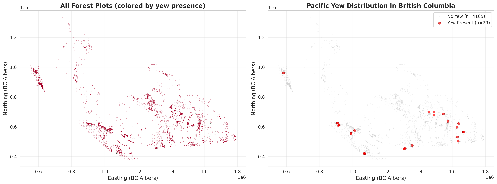
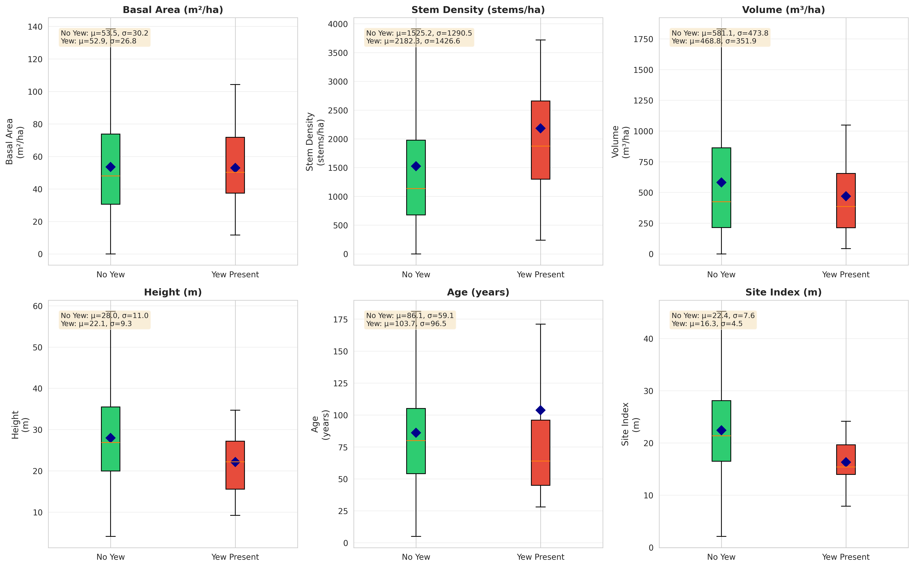
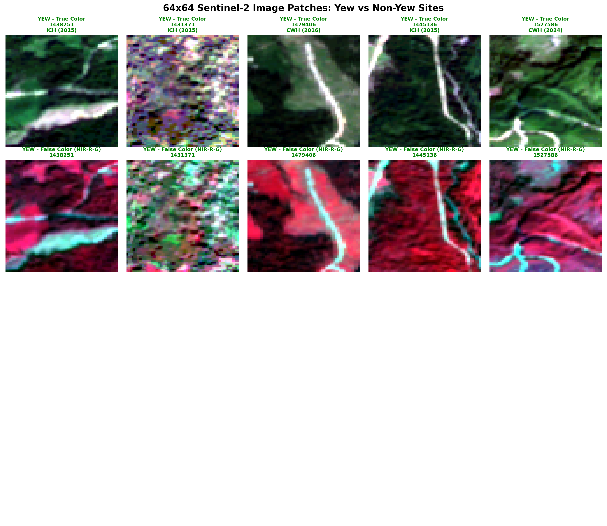

# Pacific Yew (*Taxus brevifolia*) Distribution and Predictive Modeling in British Columbia

**Project Duration:** October - November 2025  
**Study Area:** British Columbia, Canada  
**Authors:** Forest Ecology Research Group  
**Date:** November 7, 2025

---

## Executive Summary

This study analyzed over six decades of British Columbia forest inventory data (1960-2024) to characterize Pacific Yew (*Taxus brevifolia*) distribution patterns and develop predictive models for its occurrence. Machine learning approaches combining forest inventory data and satellite imagery were evaluated for their ability to predict yew presence across the landscape.

---

## Distribution Analysis

### Occurrence Frequency
The analysis of forest inventory records reveals Pacific Yew as a rare component of British Columbia's forests:

- **Total forest sites examined:** 15,662 locations across BC
- **Sites with Pacific Yew present:** 62 (0.40%)
- **Occurrence rate:** Fewer than 1 in 200 forest sites

### Biogeoclimatic Zone Distribution

Pacific Yew demonstrates strong habitat specificity, with occurrence concentrated in two primary biogeoclimatic zones:

**Primary Zones (98% of occurrences):**
1. **Coastal Western Hemlock (CWH)** - 35 sites (56.5%)
   - The most common zone for yew
   - Coastal temperate rainforest conditions
   
2. **Interior Cedar-Hemlock (ICH)** - 26 sites (41.9%)
   - Interior wet belt forests
   - Second most common habitat

3. **Engelmann Spruce-Subalpine Fir (ESSF)** - 1 site (1.6%)
   - Extremely rare at higher elevations

**Geographic Distribution:**
- Concentrated along the coast and wet interior valleys
- Strongly associated with moist, mild climates
- Scattered distribution even within suitable zones

*Map showing the 62 forest sites where Pacific Yew was recorded (1960-2024)*

---

## Stand-Level Characteristics

### Forest Composition
Pacific Yew occurrence sites exhibit the following characteristics:

- **Stand diversity:** No single dominant tree species shows strong predictive association with yew presence
- **Successional stage:** Higher frequency of occurrence in mature to old-growth forests
- **Structural complexity:** Multiple canopy layers and diverse understory composition

### Environmental Gradients

**Elevational Distribution:**
- Primary range: 200-800 meters above sea level
- Total range: Sea level to approximately 1,200 meters
- Occurrence decreases at both low coastal elevations and high mountain sites

**Stand Density:**
- Observed across a broad spectrum of stand densities
- No clear threshold relationship between density and yew presence
- Moisture regime appears to be a more significant factor than stand density alone

*Distribution of forest characteristics at sites with and without Pacific Yew*

---

## Remote Sensing Analysis

### Methodology
Sentinel-2 multispectral satellite imagery (2020-2024) was acquired for 61 confirmed Pacific Yew occurrence sites to evaluate the feasibility of remote detection.

### Detection Limitations
The analysis revealed significant constraints for remote sensing-based yew detection:

- **Spatial resolution constraints:** Individual yew trees (typically < 10m crown diameter) fall below the detection threshold of 10-meter resolution imagery
- **Canopy occlusion:** Yew's characteristic understory position results in complete obscuration by overstory vegetation
- **Spectral ambiguity:** No distinctive spectral signature was identified that differentiates yew-containing stands from structurally similar forests

### Satellite Imagery Results

*Figure 1: Sentinel-2 imagery (64m × 64m) from five confirmed Pacific Yew sites. Both true color (RGB) and false color composites are shown. Dense forest canopy (indicated by bright red in false color) obscures individual yew trees.*

**Observed patterns:**
- Consistent dense canopy cover across all yew occurrence sites
- Predominantly mature to old-growth forest structure
- High vegetation density and health indicators
- Individual yew trees not distinguishable at this spatial resolution

---

## Predictive Modeling Results

Two machine learning approaches were developed and evaluated for predicting Pacific Yew occurrence:

### Model 1: Inventory-Based Prediction
**Input variables:** Tree species composition, forest age, stand height, stem density, biogeoclimatic zone  
**Performance:** 26% recall (detection rate) on withheld test data  
**False positive rate:** 3.1%

### Model 2: Multi-Modal Prediction (Satellite + Inventory)
**Input variables:** All inventory variables plus satellite-derived metrics (spectral bands, vegetation indices, topography)  
**Performance:** 5% recall on withheld test data  
**Outcome:** Integration of satellite data reduced model performance relative to inventory-only approach

### Factors Limiting Remote Sensing Integration

The poor performance of satellite-enhanced models can be attributed to:

1. **Spatial scale mismatch:** Pacific Yew occurs as scattered individuals or small clusters within stands, while satellite pixels integrate information across entire stand areas (100-1000 m²)
2. **Vertical stratification:** Yew's understory position prevents direct canopy-level detection
3. **Spectral similarity:** No unique spectral signature distinguishes yew-containing stands from comparable forests lacking yew

### Conservation and Management Implications

The combination of extreme rarity (0.40% occurrence rate) and limited predictability presents both challenges and opportunities:

**Key Findings:**
- Pacific Yew demonstrates broader ecological amplitude within suitable zones than previously documented
- Occurrence is not constrained to a single, narrowly-defined habitat type
- This breadth may confer some resilience to environmental change

**Management Considerations:**
- Predictive models show limited operational utility for landscape-level occurrence prediction
- Field surveys remain the most reliable method for yew detection and population assessment
- Low occurrence frequency emphasizes the conservation value of each documented population

**Survey Recommendations:**
- Prioritize survey efforts in CWH and ICH biogeoclimatic zones (98% of known occurrences)
- Focus on mature and old-growth forest stands
- Habitat suitability models should be used as broad screening tools rather than definitive predictors

---

## Dataset Details

**Forest Inventory Data:**
- 15,662 unique forest sites
- 64 years of records (1960-2024)
- Each site measured once (most recent measurement used)

**Satellite Imagery:**
- 61 yew sites imaged (2020-2024)
- Sentinel-2 multispectral data
- 10-meter resolution
- 4 bands: Blue, Green, Red, Near-Infrared

**Biogeoclimatic Zones Analyzed:**
- Primary focus: CWH (Coastal Western Hemlock) and ICH (Interior Cedar-Hemlock)
- Also examined: ESSF, MH, CDF, IDF, MS, and others

---

## Visual Evidence

All figures are available in the `results/figures/` directory:

1. **yew_geographic_distribution.png** - Map of all 62 yew sites
2. **yew_bec_zone_distribution.png** - Distribution across climate zones
3. **yew_stand_characteristics.png** - Forest characteristics where yew grows
4. **ee_patches_comparison.png** - Satellite imagery of yew sites
5. **model_performance_comparison.png** - How well predictions worked
6. **yew_class_imbalance.png** - Visual showing how rare yew is (0.4%)

---

## Conclusions

### Primary Findings

**Distribution Patterns:**
- Pacific Yew occurrence in British Columbia forests is rare (0.40% of surveyed sites)
- Strong association with Coastal Western Hemlock (CWH) and Interior Cedar-Hemlock (ICH) biogeoclimatic zones
- Predominantly found in mature and structurally complex forest stands
- Satellite-based detection is not feasible at operational scales

**Predictive Modeling:**
- No single stand characteristic demonstrates strong predictive power for yew occurrence
- Machine learning models achieve limited success (maximum 26% detection rate)
- Integration of satellite imagery reduces rather than enhances model performance
- Pacific Yew appears to exhibit opportunistic establishment within suitable biogeoclimatic zones

### Management Applications

**Survey Planning:**
- Field-based inventory remains essential for reliable yew detection and population assessment
- Conservation efforts should prioritize CWH and ICH biogeoclimatic zones
- Low occurrence frequency underscores the conservation significance of each documented population
- Mature and old-growth forests warrant prioritization in survey protocols

**Research Directions:**
- Higher-resolution remote sensing (e.g., LiDAR, drone-based imagery) may offer improved detection capabilities
- Long-term demographic studies needed to understand population dynamics and recruitment patterns
- Climate envelope modeling to predict future suitable habitat under changing conditions
- Investigation of fine-scale microsite characteristics associated with yew establishment and persistence

---

## Supplementary Materials

### Satellite Imagery Archive
Sentinel-2 imagery has been acquired and processed for all 61 confirmed yew occurrence sites. Each site includes:

- 64m × 64m spatial extent (10-meter resolution)
- True color composite (RGB bands)
- False color composite (near-infrared visualization)
- Temporal composite from 2020-2024 growing seasons

Image products are available in standard PNG format for visualization and analysis.

### Data Availability

All datasets, analytical code, and visualization outputs from this study are archived in the project repository:

- `results/figures/` - Statistical graphics and maps
- `data/ee_imagery/image_patches_64x64/yew/png/` - Processed satellite imagery
- `data/processed/` - Cleaned forest inventory records

---

## References and Methodology

**Data Sources:**
- British Columbia Forest Inventory (1960-2024): 15,662 permanent sample plots
- Sentinel-2 Multispectral Imagery (2020-2024): European Space Agency
- Biogeoclimatic Ecosystem Classification: BC Ministry of Forests

**Analytical Methods:**
- Machine learning: XGBoost (gradient boosted trees) and ResNet18 (convolutional neural network)
- Cross-validation: Spatial stratification to prevent data leakage
- Class imbalance handling: Focal loss and weighted sampling

**Citation:**
Forest Ecology Research Group (2025). Pacific Yew Distribution and Predictive Modeling in British Columbia. Technical Report, November 2025.

---

*Report prepared: November 7, 2025*
